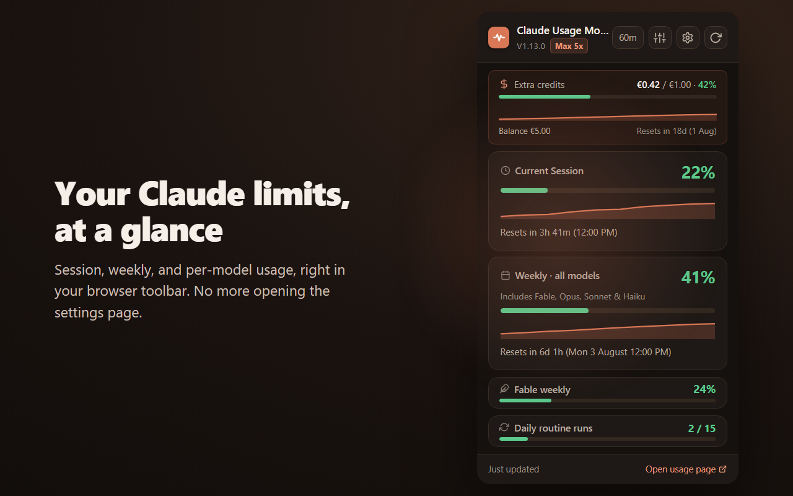
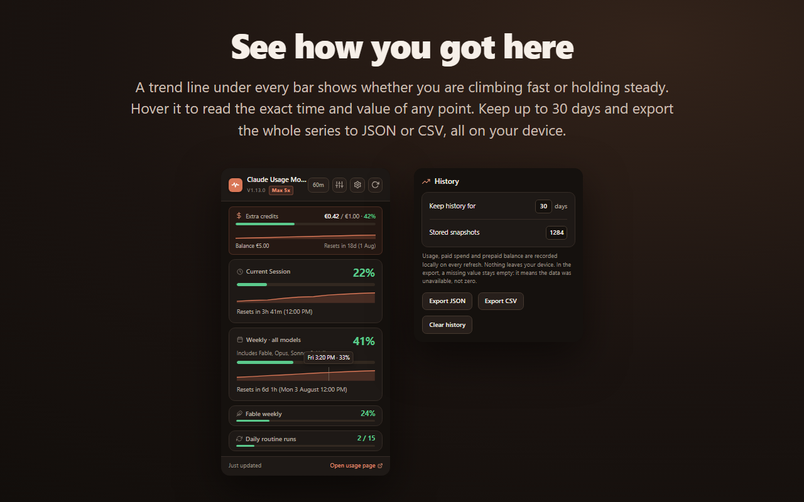
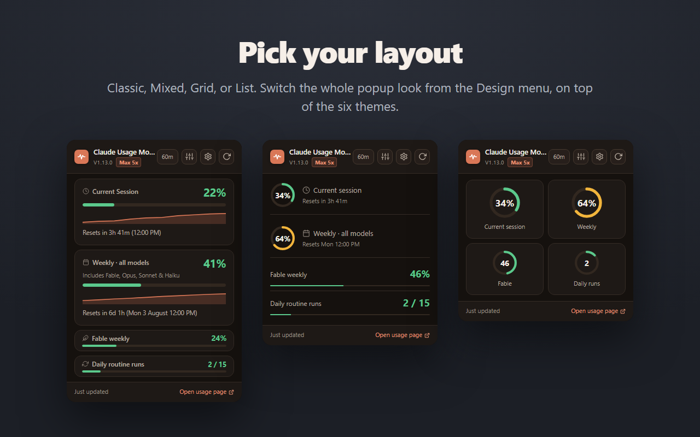
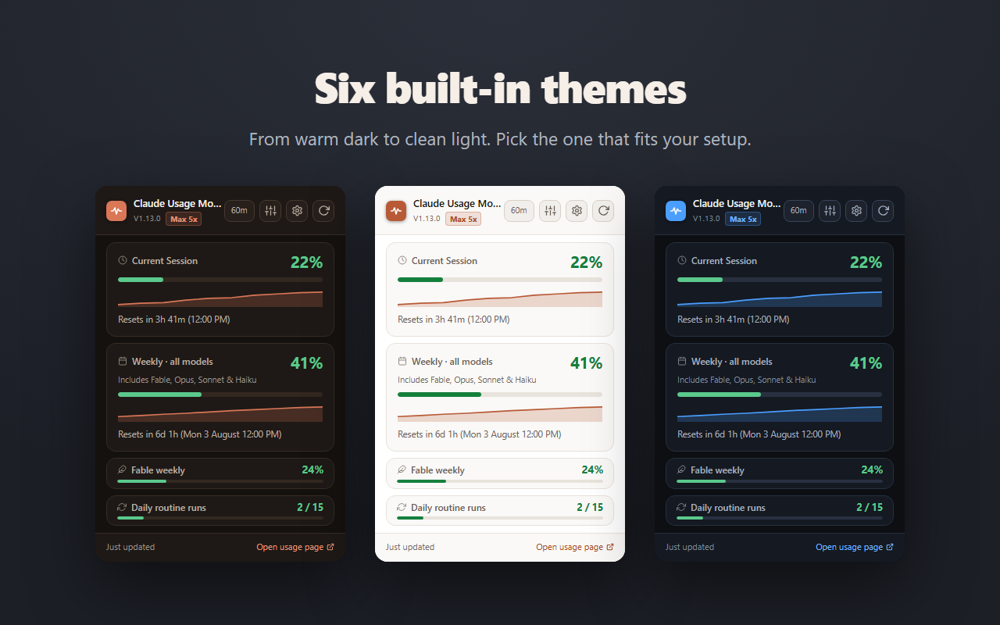

# Claude Usage Monitor

Claude Usage Monitor is a Manifest V3 browser extension for Claude.ai that shows your current usage directly from the toolbar popup. **Open source (MIT)**: all code in this repo is exactly what runs in your browser.

It displays your usage buckets:

- **Current Session**: the current 5-hour-window Claude usage percentage.
- **Weekly limit**: the weekly usage percentage across all models.
- **Per-model weekly sub-limits**: Fable, Opus, Sonnet and Claude Design weekly usage (on paid plans). Show or hide each from the **Metrics** section of the popup's options menu.
- **Daily routine runs**: included Claude Code routine runs as a `used / limit` count (on plans that include them).
- **Paid extra credits**: spend against your monthly limit, plus your remaining prepaid balance, when your plan has them enabled.
- **Your plan**: a badge in the popup header shows your Claude subscription (e.g. *Max 5x*).

## Usage history

Every successful refresh is recorded locally as one sample, so the popup can draw a trend line under each bar: 15% with four hours left stops looking the same as 15% reached in twenty minutes.

- Hover any curve to read the exact time and value of the sample under the cursor. It snaps to the nearest stored reading and never interpolates.
- The horizontal axis is the live reset window, so a curve never crosses a reset and never stretches a short history across the full width.
- Retention is configurable up to 30 days, with a one-click clear and export to JSON or CSV.
- A refresh that fails writes nothing. A gap in the series means the reading was unavailable, never that usage was zero, and the export keeps that distinction.
- Turn the curve off under **Trend line** in the view menu.

## Notifications

Desktop alerts fire at 80% and 95% for your session, weekly and per-model caps, once per threshold per reset window. Thresholds are configurable in the settings page, and the whole feature can be turned off. The `notifications` permission is optional and requested at runtime, so the extension never asks for it until you enable alerts.

## How it works

The extension refreshes usage through Claude.ai's internal authenticated API.

- Automatic refresh at a configurable interval: 1, 2, 5, 10 or 60 minutes.
- Manual refresh is available from the popup.
- The popup shows the extension version so you can confirm which local build is loaded.
- A badge in the header shows your Claude plan (e.g. Max 5x).
- When your claude.ai session expires, an inline banner says so and the last known data stays visible instead of being replaced by zeros.

## Features

- Toolbar badge showing the current session percentage: green under 50%, yellow 50 to 80%, red above 80%.
- Popup with current session and weekly usage cards.
- Per-model weekly sub-limit cards (Fable, Opus, Sonnet and Claude Design), offered on paid plans.
- Usage history with a trend line under the session, weekly and spend bars, hover readout, configurable retention and JSON/CSV export.
- Desktop notifications at 80% and 95%, with configurable thresholds.
- **Display options** menu in the popup: a **Metrics** section to show/hide optional cards (per-model weekly limits, daily routine runs and extra credits, with Select all / Deselect all), a **Design** section for the four layouts and the trend line, and a **Theme** section with six color palettes; your choices are remembered.
- Daily routine-runs card (`used / limit`), shown only on plans that include routine runs.
- Paid extra-credits card with spend, monthly limit and prepaid balance.
- Subscription badge in the header (Max, Pro, Team, etc.).
- Reset countdowns when Claude returns reset timestamps.
- Manual refresh button.
- Quick link to `https://claude.ai/settings/usage`.
- Local storage caching so the last known value remains visible between refreshes.

| Four layouts: Classic, Mixed, Grid, List | Six color themes |
|---|---|
|  |  |

## Browser support

- **Google Chrome**: Manifest V3, uses `manifest.json`.
- **Mozilla Firefox**: Manifest V3, uses `manifest.firefox.json` (packaged as `manifest.json` by the build script).

The codebase uses the standard `chrome.*` extension APIs, which Firefox supports via the WebExtensions namespace.

## Run locally

Load the unpacked extension from the inner `extension/` directory in this repository.

The extension files are here:

- `extension/manifest.json`
- `extension/background.js`
- `extension/popup.html`

### Chrome

1. Open `chrome://extensions`.
2. Enable **Developer mode**.
3. Click **Load unpacked**.
4. Select the `extension/` folder inside this repo.
5. Pin the extension if you want fast access from the toolbar.

### Firefox

Firefox uses a separate manifest (`manifest.firefox.json`). To load it temporarily:

1. In a copy of the `extension/` folder, replace `manifest.json` with the contents of `manifest.firefox.json` (Firefox reads `manifest.json`).
2. Open `about:debugging#/runtime/this-firefox`.
3. Click **Load Temporary Add-on...**.
4. Select the `manifest.json` inside that copied folder.
5. The add-on stays loaded until you restart Firefox.

For a permanent install, use the published add-on at <https://addons.mozilla.org/firefox/addon/claude-usage-meter/>.

## Notes for local testing

- You must already be logged in to `https://claude.ai`.
- After loading the extension, open the popup and confirm the version shown there matches the current build.
- Automatic refresh should work without manually opening the usage page.
- Usage is read exclusively through Claude.ai's authenticated API in `background.js`. If Claude changes that internal API, refresh may stop working until the extension is updated.

## Project structure

- `extension/manifest.json`: extension manifest and permissions.
- `extension/background.js`: automatic refresh logic, Claude API fetching, storage, usage-history sampling, threshold notifications, and badge updates.
- `extension/popup.html`: popup markup.
- `extension/popup.css`: popup styling.
- `extension/popup.js`: popup rendering, sparklines and their hover readout, manual refresh flow, and storage listeners.
- `extension/options.html` and `extension/options.js`: settings page with notification thresholds, history retention, export and clear.

## Privacy

- All data is stored locally on your device via `chrome.storage.local`, including the usage history: no account, no server, no sync.
- No analytics, no telemetry, no third parties.
- The extension cannot read your chats, projects, files, or any other Claude.ai content.
- Host permissions are scoped to specific Claude.ai API endpoints. See [SECURITY.md](SECURITY.md) for the full permission breakdown.
- Full privacy policy: <https://claude-monitor.com/privacy>

## Contributing

Bug reports and feature requests are welcome via [GitHub Issues](https://github.com/claude-monitor/claude-monitor-browser-extension/issues).

Pull requests are welcome. For non-trivial changes, please open an issue first to discuss the scope.

## Security

The full security model, threat model, and vulnerability-reporting process are documented in **[SECURITY.md](SECURITY.md)**.

To report a vulnerability, email <martin.sadofschi@gmail.com> instead of opening a public issue.

## License

[MIT](LICENSE) © Digital Advanced Solutions

Claude Usage Monitor is an independent project and is not affiliated with Anthropic.
